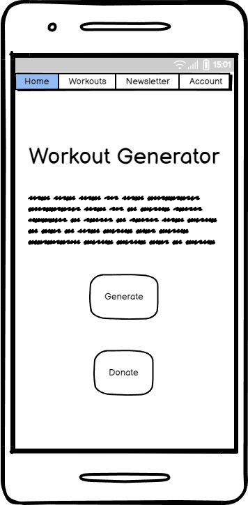
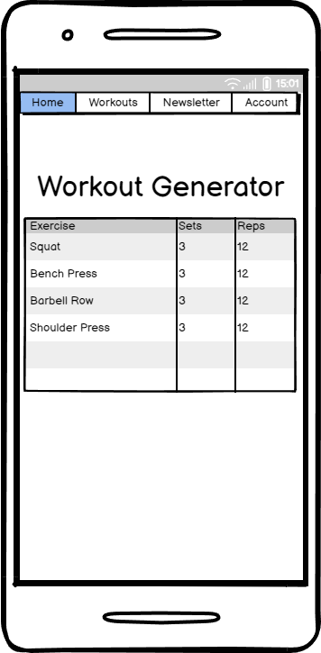
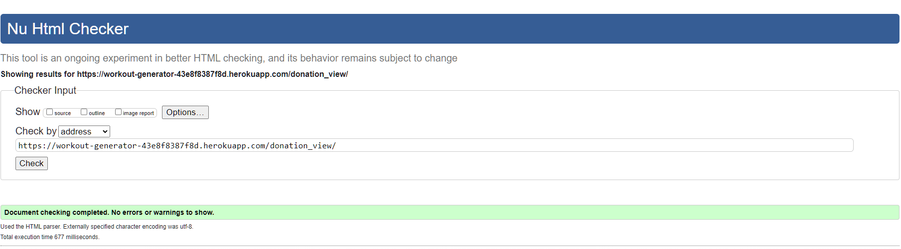
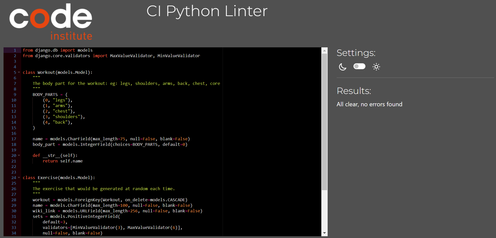
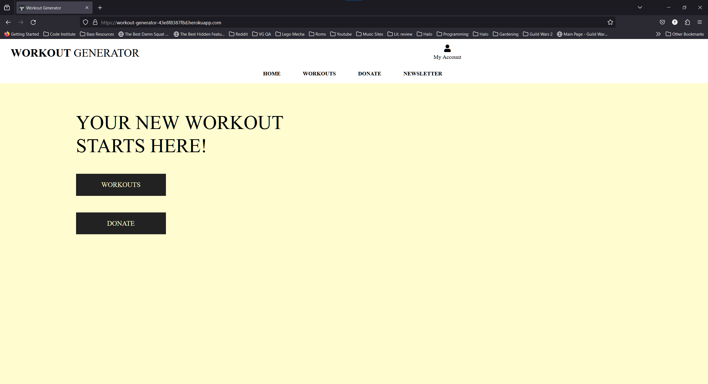
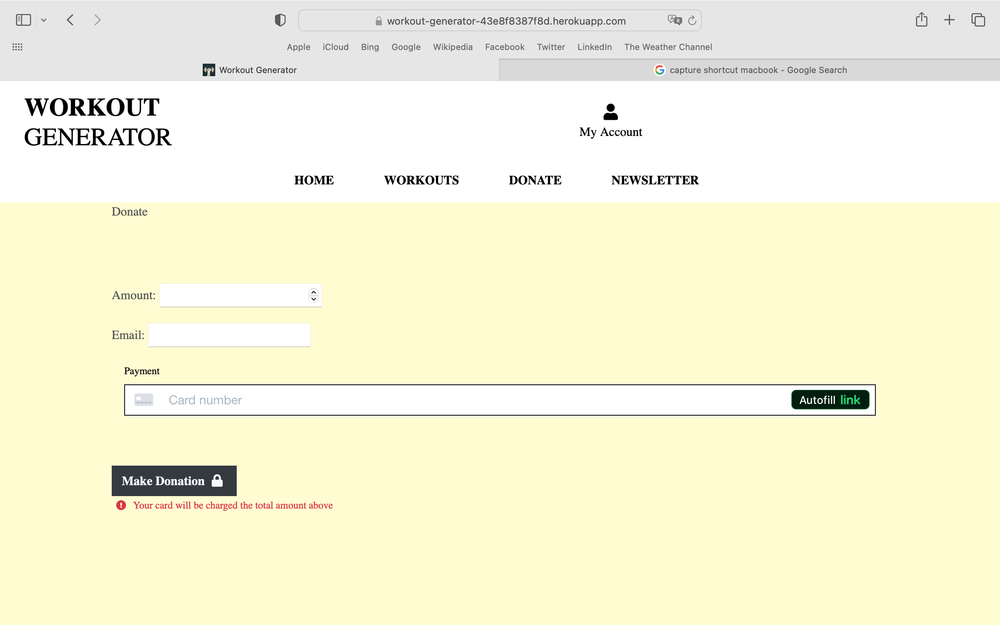
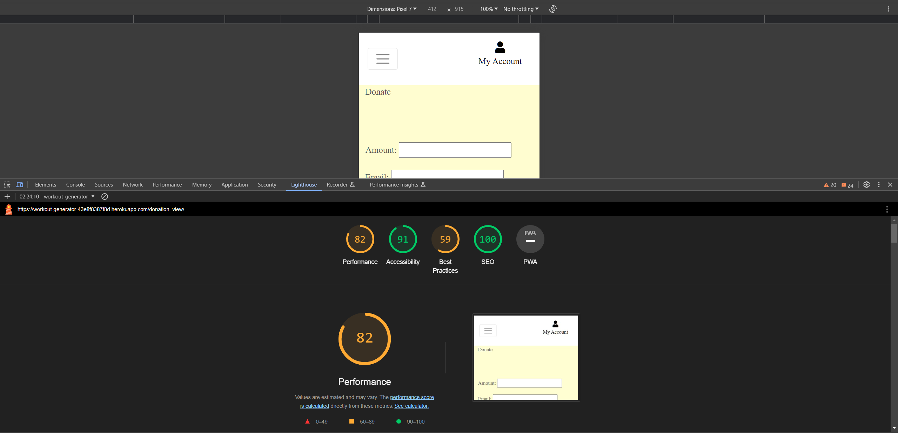
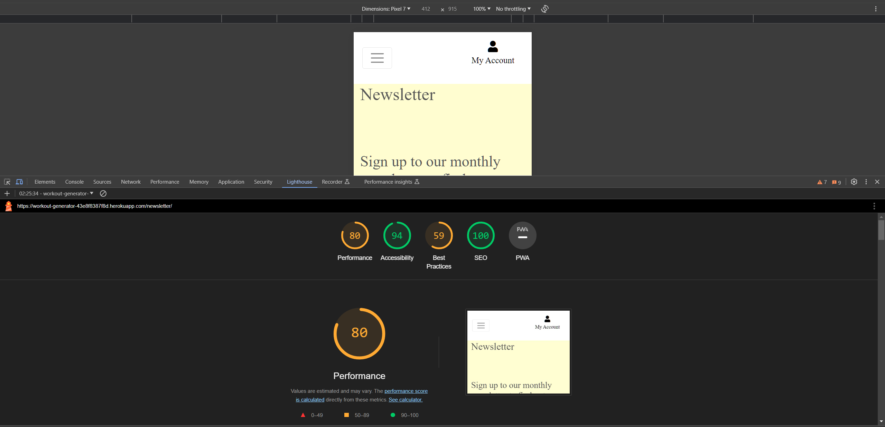

# [WORKOUT GENERATOR](https://workout-generator-43e8f8387f8d.herokuapp.com)

[](https://github.com/tadhgnolan/workout-generator/commits/main)
[](https://github.com/tadhgnolan/workout-generator/commits/main)
[](https://github.com/tadhgnolan/workout-generator)

---
Workout Generator is a bodybuilding/aesthetic focused physical fitness app designed to give experienced users a randomly generated workout to make the process of exercise selection for each training cycle easier. 

Progressive overload is a core principle of bodybuilding and many other forms of physical training. In layman's terms an individual will adapt to any form of consistent training over time, therefore it’s necessary to adjust training variables such as load (weight), volume (work done) & exercise selection periodically, in some cases every 6 - 8 weeks.

This app aims to simplify that process by randomly selecting exercises for each muscle group from a database for the user.


source: [amiresponsive](https://ui.dev/amiresponsive?url=https://workout-generator-43e8f8387f8d.herokuapp.com)

## UX
An Agile methodology was used in planning the project utilising Github's Project 
kanban. Issues were used to create user stories. When work began on a user story, it was moved to the "In Progress" column. When the task is complete, it is marked as closed. Labels were used to mark priority of issue. Milestones were used to set major project objectives. A column named “Could Have” is used for prospective features for the website and for any features that were not complete by the project deadline.

### Colour Scheme

I used [coolors.co](https://coolors.co/ffffff-fffdd0-ffc107-28a745-007bff-555555-000000) to generate my colour palette.


### Typography

- [Lato](https://fonts.google.com/specimen/Lato) was used for all other secondary text.

- [Font Awesome](https://fontawesome.com) icons were used throughout the site, such as the social media icons in the footer.

## User Stories

### New Site Users

- As a new site user, I would like to register, so that I can create an account. [#1](https://github.com/tadhgnolan/workout-generator/issues/1)
- As a new site user, I would like to easily navigate the site using the navbar or get back to the home page by clicking the logo. [#2](https://github.com/tadhgnolan/workout-generator/issues/2)
- As a new site user, I would like to input my fitness level (beginner, intermediate, advanced), so that the site can generate workouts suitable for me. [#3](https://github.com/tadhgnolan/workout-generator/issues/3)
- As a new site user, I would like to specify the equipment I have available (resistance bands, dumbbells, machines etc.), so that the app can generate workouts suitable for what I have available. [#4](https://github.com/tadhgnolan/workout-generator/issues/4)
- As a new site user, I would like to be able to substitute exercises, so that I can replace any that are not suitable for me. [#5](https://github.com/tadhgnolan/workout-generator/issues/5)
- As a new site user, I would like to be able to donate to the site, so that I can show my support & they can provide a better service. [#6](https://github.com/tadhgnolan/workout-generator/issues/6)


### Returning Site Users

- As a returning site user, I would like to log into my account. [7](https://github.com/tadhgnolan/workout-generator/issues/7)
- As a returning site user, I would like to see a list of new features, so that I can try them out. [#8](https://github.com/tadhgnolan/workout-generator/issues/8)
- As a returning site user, I would like to track my progress (workouts completed etc.) over time, so that I can see how I have improved. [#9](https://github.com/tadhgnolan/workout-generator/issues/9)
- As a returning site user, I would like to view my workout history, so that I can see what workouts I've done in the past. [#10](https://github.com/tadhgnolan/workout-generator/issues/10)
- As a returning site user, I would like to be able to provide feedback on the workout an the app, so that it can be improved over time based on my experience. [#11](https://github.com/tadhgnolan/workout-generator/issues/11)

### Site Admin

- As a site administrator, I should be able to log into the admin panel using my credentials, so that I can manage the application. [#12](https://github.com/tadhgnolan/workout-generator/issues/12)
- As a site administrator, I should be able to be able to view all user accounts, so that I can monitor user activity. [#13](https://github.com/tadhgnolan/workout-generator/issues/13)
- As a site administrator, I should be able to deactivate or activate user accounts, so that I can manage user access to advamced features of the app. [#14](https://github.com/tadhgnolan/workout-generator/issues/14)
- As a site administrator, I should be able to add, edit and delete exercises in the database, so that I can manage the exercises available to users. [#15](https://github.com/tadhgnolan/workout-generator/issues/15)
- As a site administrator, I should be able to able to view user progress and statistics, so that I can understand user engagement and app effectiveness. [#16](https://github.com/tadhgnolan/workout-generator/issues/16)
- As a site administrator, I should be able to view and manage user feedback, so that I can improve the app based on user suggestions. [#17](https://github.com/tadhgnolan/workout-generator/issues/17)

## Wireframes

To follow best practice, wireframes were developed for mobile, tablet, and desktop sizes.
I've used [Balsamiq](https://balsamiq.com/wireframes) to design my site wireframes.

### Mobile Wireframes

<details>
<summary> Click here to see the Mobile Wireframes </summary>

Home
  - 

Workouts
  - 

Newsletter
  - 

</details>

### Tablet Wireframes

<details>
<summary> Click here to see the Tablet Wireframes </summary>

Home
  - 

Workouts
  - 

Newsletter
  - 

</details>

### Desktop Wireframes

<details>
<summary> Click here to see the Desktop Wireframes </summary>

Home
  - 

Workouts
  - 

Newsletter
  - 

</details>

## Features

🛑🛑🛑🛑🛑🛑🛑🛑🛑🛑 START OF NOTES (to be deleted)

In this section, you should go over the different parts of your project,
and describe each in a sentence or so.

You will need to explain what value each of the features provides for the user,
focusing on who this website is for, what it is that they want to achieve,
and how your project is the best way to help them achieve these things.

For some/all of your features, you may choose to reference the specific project files that implement them.

IMPORTANT: Remember to always include a screenshot of each individual feature!

🛑🛑🛑🛑🛑🛑🛑🛑🛑🛑-END OF NOTES (to be deleted)

### Existing Features

- **Registration Page**

    - Allows new users to register an account with username and password.


- **Login Page**

    - Registered user can login.


- **Home Page**

    - Users can read an introduction, click on a donation button and access the rest of the website through the navbar


- **Add Workout/Exercise**

    - Admin users can add workouts and exercises to the database.


- **Edit Workout/Exercise**

    - Admin users can edit workouts and exercises in the database.


- **404 Page**

    - In case the user somehow navigates to a broken/missing page, there is a 404 page.


- **YOUR-TITLE-FOR-FEATURE-#7**

    - Details about this particular feature, including the value to the site, and benefit for the user. Be as detailed as possible!


🛑🛑🛑🛑🛑🛑🛑🛑🛑🛑 START OF NOTES (to be deleted)

Repeat as necessary for as many features as your site contains.

Hint: the more, the merrier!

🛑🛑🛑🛑🛑🛑🛑🛑🛑🛑-END OF NOTES (to be deleted)

### Future Features

- (Admin): View Feedback [#17](https://github.com/tadhgnolan/workout-generator/issues/17)
- (Admin): View User Statistics [#16](https://github.com/tadhgnolan/workout-generator/issues/16)
- Feedback [#11](https://github.com/tadhgnolan/workout-generator/issues/11)
- Workout History [#10](https://github.com/tadhgnolan/workout-generator/issues/10)
- Track Workout Progress [#9](https://github.com/tadhgnolan/workout-generator/issues/9)
- List of New Features [#8](https://github.com/tadhgnolan/workout-generator/issues/8)
- Substitute Exercise [#5](https://github.com/tadhgnolan/workout-generator/issues/5)
- Equipment [#4](https://github.com/tadhgnolan/workout-generator/issues/4)
- Input Fitness Level [#3](https://github.com/tadhgnolan/workout-generator/issues/3)

## Tools & Technologies Used


- [](https://tim.2bn.dev/markdown-builder) used to generate README and TESTING templates.
- [](https://git-scm.com) used for version control. (`git add`, `git commit`, `git push`)
- [](https://github.com) used for secure online code storage.
- [](https://gitpod.io) used as a cloud-based IDE for development.
- [](https://en.wikipedia.org/wiki/HTML) used for the main site content.
- [](https://en.wikipedia.org/wiki/CSS) used for the main site design and layout.
- [](https://www.javascript.com) used for user interaction on the site.
- [](https://jquery.com) used for user interaction on the site.
- [](https://www.python.org) used as the back-end programming language.
- [](https://www.heroku.com) used for hosting the deployed back-end site.
- [](https://getbootstrap.com) used as the front-end CSS framework for modern responsiveness and pre-built components.
- [](https://www.djangoproject.com) used as the Python framework for the site.
- [](https://www.postgresql.org) used as the relational database management.
- [](https://dbs.ci-dbs.net) used as the Postgres database from Code Institute.
- [](https://whitenoise.readthedocs.io) used for serving static files with Heroku.
- [](https://stripe.com) used for online secure payments of ecommerce products/services.
- [](https://balsamiq.com/wireframes) used for creating wireframes.
- [](https://fontawesome.com) used for the icons.
- [](https://chat.openai.com) used to help debug, troubleshoot, and explain things.

## Database Design

Entity Relationship Diagrams (ERD) help to visualize database architecture before creating models.
Understanding the relationships between different tables can save time later in the project.

### Donate App

- `Donation` Model

```python
class Donation(models.Model):
    order_number = models.CharField(max_length=2555, unique=True)
    email = models.EmailField(max_length=254, null=False, blank=False)
    amount = models.DecimalField(max_digits=6, decimal_places=2, default=5.00) # €5 fixed amount
    stripe_product_id = models.CharField(max_length=255, unique=True) # Store Stripe Product ID
    date = models.DateTimeField(auto_now_add=True)
```

### Generator App

- `Workout` Model

```python
class Workout(models.Model):
    """
    The body part for the workout: eg: legs, shoulders, arms, back, chest, core
    """
    BODY_PARTS = (
        (0, "legs"),
        (1, "arms"),
        (2, "chest"),
        (3, "shoulders"),
        (4, "back"),
    )

    name = models.CharField(max_length=75, null=False, blank=False)
    body_part = models.IntegerField(choices=BODY_PARTS, default=0)
```

- `Exercise` Model

```python
class Exercise(models.Model):
    """
    The exercise that would be generated at random each time.
    """
    workout = models.ForeignKey(Workout, on_delete=models.CASCADE)
    name = models.CharField(max_length=100, null=False, blank=False)
    wiki_link = models.URLField(max_length=256, null=False, blank=False)
    sets = models.PositiveIntegerField(
        default=3,
        validators=[MinValueValidator(3), MaxValueValidator(6)],
        null=False, blank=False)
    reps = models.PositiveIntegerField(
        default=12,
        validators=[MinValueValidator(12), MaxValueValidator(20)],
        null=False, blank=False)
    muscle_focus = models.CharField(max_length=50, null=False, blank=False)
    description = models.TextField(null=False, blank=False)
```

### Newsletter App

- `Newsletter` Model

```python
class Newsletter(models.Model):
    email = models.EmailField(max_length=256, null=False, blank=False)
```

### ERD

I have used `pygraphviz` and `django-extensions` to auto-generate an ERD.

The steps taken were as follows:
- In the terminal: `sudo apt update`
- then: `sudo apt-get install python3-dev graphviz libgraphviz-dev pkg-config`
- then type `Y` to proceed
- then: `pip3 install django-extensions pygraphviz`
- in my `settings.py` file, I added the following to my `INSTALLED_APPS`:
```python
INSTALLED_APPS = [
    ...
    'django_extensions',
    ...
]
```
- back in the terminal: `python3 manage.py graph_models -a -o erd.png`
- dragged the new `erd.png` file into my `documentation/` folder
- removed `'django_extensions',` from my `INSTALLED_APPS`
- finally, in the terminal: `pip3 uninstall django-extensions pygraphviz -y`


source: [medium.com](https://medium.com/@yathomasi1/1-using-django-extensions-to-visualize-the-database-diagram-in-django-application-c5fa7e710e16)


## Agile Development Process

### GitHub Projects

[GitHub Projects](https://github.com/tadhgnolan/workout-generator/projects) served as an Agile tool for this project.
It isn't a specialized tool, but with the right tags and project creation/issue assignments, it can be made to work.

Through it, user stories, issues, and milestone tasks were planned, then tracked on a weekly basis using the basic Kanban board.


### GitHub Issues

[GitHub Issues](https://github.com/tadhgnolan/workout-generator/issues) served as an another Agile tool.
There, I used my own **User Story Template** to manage user stories.

It also helped with milestone iterations on a weekly basis.


- [](https://github.com/tadhgnolan/workout-generator/issues)

- [](https://github.com/tadhgnolan/workout-generator/issues?q=is%3Aissue+is%3Aclosed)

### MoSCoW Prioritization

I've decomposed my Epics into stories prior to prioritizing and implementing them.
Using this approach, I was able to apply the MoSCow prioritization and labels to my user stories within the Issues tab.

- **Must Have**: guaranteed to be delivered (*max 60% of stories*)
- **Should Have**: adds significant value, but not vital (*the rest ~20% of stories*)
- **Could Have**: has small impact if left out (*20% of stories*)
- **Won't Have**: not a priority for this iteration

## Ecommerce Business Model

This site sells goods to individual customers, and therefore follows a `Business to Customer` model.
It is of the simplest **B2C** forms, as it focuses on individual transactions, and doesn't need anything
such as monthly/annual subscriptions.

It is still in its early development stages, although it already has a newsletter, and links for social media marketing.

Social media can potentially build a community of users around the business, and boost site visitor numbers,
especially when using larger platforms such a Facebook.

A newsletter list can be used by the business to send regular messages to site users.
For example, what items are on special offer, new items in stock,
updates to business hours, notifications of events, and much more!

## Search Engine Optimization (SEO) & Social Media Marketing

### Keywords

I've identified some appropriate keywords to align with my site, that should help users
when searching online to find my page easily from a search engine.
This included a series of the following keyword types

- Short-tail (head terms) keywords
- Long-tail keywords

I also played around with [Word Tracker](https://www.wordtracker.com) a bit
to check the frequency of some of my site's primary keywords (only until the free trial expired).

### Sitemap

I've used [XML-Sitemaps](https://www.xml-sitemaps.com) to generate a sitemap.xml file.
This was generated using my deployed site URL: https://workout-generator-43e8f8387f8d.herokuapp.com

After it finished crawling the entire site, it created a
[sitemap.xml](sitemap.xml) which I've downloaded and included in the repository.

### Robots

I've created the [robots.txt](robots.txt) file at the root-level.
Inside, I've included the default settings:

```
User-agent: *
Disallow:
Sitemap: https://workout-generator-43e8f8387f8d.herokuapp.com/sitemap.xml
```

Further links for future implementation:
- [Google search console](https://search.google.com/search-console)
- [Creating and submitting a sitemap](https://developers.google.com/search/docs/advanced/sitemaps/build-sitemap)
- [Managing your sitemaps and using sitemaps reports](https://support.google.com/webmasters/answer/7451001)
- [Testing the robots.txt file](https://support.google.com/webmasters/answer/6062598)

### Social Media Marketing

Creating a strong social base (with participation) and linking that to the business site can help drive sales.
Using more popular providers with a wider user base, such as Facebook, typically maximizes site views.

I've created a placeholder Facebook business account on
[Facebook](https://www.facebook.com/profile.php?id=61559076988919).


#### External Links

For pages that open in a new tab, I've used the `target="_blank"` and `rel="nofollow noreferrer"` attributes.

- View Wiki Page for Workout

```html
<!-- external link to wiki page -->
<a href="{{ exercise.wiki_link }}" target="_blank" rel="nofollow noreferrer" class="btn btn-light m-1">View Exercise</a>
```

### Newsletter Marketing

I have incorporated a newsletter sign-up form on my application made using a custom Django model, to allow users to supply their
email address if they are interested in learning more.

- `Newsletter` Model

```python
class Newsletter(models.Model):
    email = models.EmailField(max_length=256, null=False, blank=False)
```


## Deployment

The live deployed application can be found deployed on [Heroku](https://workout-generator-43e8f8387f8d.herokuapp.com).

### Whitenoise

This project uses WhiteNoise to handle static files for the deployed site on Heroku. There aren't any requirements for user-uploaded files/images, so it wasn't necessary to use something like AWS-S3 or Cloudinary.

- `pip3 install whitenoise`

`settings.py`
```python
MIDDLEWARE = [
    ...
    'whitenoise.middleware.WhiteNoiseMiddleware',
    ...
]
```

### PostgreSQL Database

This project uses a [Code Institute PostgreSQL Database](https://dbs.ci-dbs.net).

To obtain my own Postgres Database from Code Institute, I followed these steps:

- Signed-in to the CI LMS using my email address.
- An email was sent to me with my new Postgres Database.

> [!CAUTION]  
> - PostgreSQL databases by Code Institute are only available to CI Students.
> - You must acquire your own PostgreSQL database through some other method
> if you plan to clone/fork this repository.
> - Code Institute students are allowed a maximum of 8 databases.
> - Databases are subject to deletion after 18 months.

### Stripe API

This project uses [Stripe](https://stripe.com) to handle the ecommerce payments.

Once you've created a Stripe account and logged-in, follow these series of steps to get your project connected.

- From your Stripe dashboard, click to expand the "Get your test API keys".
- You'll have two keys here:
	- `STRIPE_PUBLIC_KEY` = Publishable Key (starts with **pk**)
	- `STRIPE_SECRET_KEY` = Secret Key (starts with **sk**)

As a backup, in case users prematurely close the purchase-order page during payment, we can include Stripe Webhooks.

- From your Stripe dashboard, click **Developers**, and select **Webhooks**.
- From there, click **Add Endpoint**.
	- `https://workout-generator-43e8f8387f8d.herokuapp.com/checkout/wh/`
- Click **receive all events**.
- Click **Add Endpoint** to complete the process.
- You'll have a new key here:

### Heroku Deployment

This project uses [Heroku](https://www.heroku.com), a platform as a service (PaaS) that enables developers to build, run, and operate applications entirely in the cloud.

Deployment steps are as follows, after account setup:

- Select **New** in the top-right corner of your Heroku Dashboard, and select **Create new app** from the dropdown menu.
- Your app name must be unique, and then choose a region closest to you (EU or USA), and finally, select **Create App**.
- From the new app **Settings**, click **Reveal Config Vars**, and set your environment variables.

> [!IMPORTANT]  
> This is a sample only; you would replace the values with your own if cloning/forking my repository.

| Key | Value |
| --- | --- |
| `DATABASE_URL` | user's own value |
| `DISABLE_COLLECTSTATIC` | 1 (*this is temporary, and can be removed for the final deployment*) |
| `EMAIL_HOST_PASS` | user's own value |
| `EMAIL_HOST_USER` | user's own value |
| `SECRET_KEY` | user's own value |
| `STRIPE_PUBLIC_KEY` | user's own value |
| `STRIPE_SECRET_KEY` | user's own value |

Heroku needs three additional files in order to deploy properly.

- requirements.txt
- Procfile
- runtime.txt

You can install this project's **requirements** (where applicable) using:

- `pip3 install -r requirements.txt`

If you have your own packages that have been installed, then the requirements file needs updated using:

- `pip3 freeze --local > requirements.txt`

The **Procfile** can be created with the following command:

- `echo web: gunicorn app_name.wsgi > Procfile`
- *replace **app_name** with the name of your primary Django app name; the folder where settings.py is located*

The **runtime.txt** file needs to know which Python version you're using:
1. type: `python3 --version` in the terminal.
2. in the **runtime.txt** file, add your Python version:
	- `python-3.9.18`

For Heroku deployment, follow these steps to connect your own GitHub repository to the newly created app:

Either:

- Select **Automatic Deployment** from the Heroku app.

Or:

- In the Terminal/CLI, connect to Heroku using this command: `heroku login -i`
- Set the remote for Heroku: `heroku git:remote -a app_name` (replace *app_name* with your app name)
- After performing the standard Git `add`, `commit`, and `push` to GitHub, you can now type:
	- `git push heroku main`

The project should now be connected and deployed to Heroku!

### Local Deployment

This project can be cloned or forked in order to make a local copy on your own system.

For either method, you will need to install any applicable packages found within the *requirements.txt* file.

- `pip3 install -r requirements.txt`.

You will need to create a new file called `env.py` at the root-level,
and include the same environment variables listed above from the Heroku deployment steps.

> [!IMPORTANT]  
> This is a sample only; you would replace the values with your own if cloning/forking my repository.

Sample `env.py` file:

```python
import os

os.environ.setdefault("DATABASE_URL", "user's own value")
os.environ.setdefault("EMAIL_HOST_PASS", "user's own value")
os.environ.setdefault("EMAIL_HOST_USER", "user's own value")
os.environ.setdefault("SECRET_KEY", "user's own value")
os.environ.setdefault("STRIPE_PUBLIC_KEY", "user's own value")
os.environ.setdefault("STRIPE_SECRET_KEY", "user's own value")

# local environment only (do not include these in production/deployment!)
os.environ.setdefault("DEBUG", "True")
```

Once the project is cloned or forked, in order to run it locally, you'll need to follow these steps:

- Start the Django app: `python3 manage.py runserver`
- Stop the app once it's loaded: `CTRL+C` or `⌘+C` (Mac)
- Make any necessary migrations: `python3 manage.py makemigrations`
- Migrate the data to the database: `python3 manage.py migrate`
- Create a superuser: `python3 manage.py createsuperuser`
- Load fixtures (if applicable): `python3 manage.py loaddata file-name.json` (repeat for each file)
- Everything should be ready now, so run the Django app again: `python3 manage.py runserver`

If you'd like to backup your database models, use the following command for each model you'd like to create a fixture for:

- `python3 manage.py dumpdata your-model > your-model.json`
- *repeat this action for each model you wish to backup*

#### Cloning

You can clone the repository by following these steps:

1. Go to the [GitHub repository](https://github.com/tadhgnolan/workout-generator) 
2. Locate the Code button above the list of files and click it 
3. Select if you prefer to clone using HTTPS, SSH, or GitHub CLI and click the copy button to copy the URL to your clipboard
4. Open Git Bash or Terminal
5. Change the current working directory to the one where you want the cloned directory
6. In your IDE Terminal, type the following command to clone my repository:
	- `git clone https://github.com/tadhgnolan/workout-generator.git`
7. Press Enter to create your local clone.

Alternatively, if using Gitpod, you can click below to create your own workspace using this repository.

[](https://gitpod.io/#https://github.com/tadhgnolan/workout-generator)

Please note that in order to directly open the project in Gitpod, you need to have the browser extension installed.
A tutorial on how to do that can be found [here](https://www.gitpod.io/docs/configure/user-settings/browser-extension).

#### Forking

By forking the GitHub Repository, we make a copy of the original repository on our GitHub account to view and/or make changes without affecting the original owner's repository.
You can fork this repository by using the following steps:

1. Log in to GitHub and locate the [GitHub Repository](https://github.com/tadhgnolan/workout-generator)
2. At the top of the Repository (not top of page) just above the "Settings" Button on the menu, locate the "Fork" Button.
3. Once clicked, you should now have a copy of the original repository in your own GitHub account!

### Local VS Deployment

There are no major differences between the local (Gitpod) version and the live deployed (Heroku) version.

## Credits

### Content

| Source | Location | Notes |
| --- | --- | --- |
| [Markdown Builder](https://tim.2bn.dev/markdown-builder) | README and TESTING | tool to help generate the Markdown files |
| [Chris Beams](https://chris.beams.io/posts/git-commit) | version control | "How to Write a Git Commit Message" |
| [WhiteNoise](http://whitenoise.evans.io) | entire site | hosting static files on Heroku temporarily |

### Media

| Source | Location | Type | Notes |
| --- | --- | --- | --- |
| [TinyPNG](https://tinypng.com) | entire site | image | tool for image compression |

### Acknowledgements

- I would like to thank my Code Institute mentor, [Tim Nelson](https://github.com/TravelTimN) for his support throughout the development of this project.
- I would like to thank the [Code Institute](https://codeinstitute.net) tutor team for their assistance with troubleshooting and debugging some project issues.
- I would like to thank the [Code Institute Slack community](https://code-institute-room.slack.com) for the moral support; it kept me going during periods of self doubt and imposter syndrome.
- I would like to thank my partner Rossana, for believing in me, and allowing me to make this transition into software development.
- I would like to thank my brother, Cormac Nolan, for providing advice & feeback from his own experience gained as a developer.

# Testing

## Code Validation


### HTML

I have used the recommended [HTML W3C Validator](https://validator.w3.org) to validate all of my HTML files.

| Directory | File | Screenshot | Notes |
| --- | --- | --- | --- |
| donate | donation.html |  | |
| newsletter | newsletter.html |  | |
| generator | add_exercise.html |  | |
| generator | add_workout.html |  | |
| generator | edit_exercise.html |  | |
| generator | edit_workout.html |  | |
| generator | generator.html |  | |
| home | index.html |  | |
| newsletter | newsletter.html |  | |

### CSS

I have used the recommended [CSS Jigsaw Validator](https://jigsaw.w3.org/css-validator) to validate all of my CSS files.

| Directory | File | Screenshot | Notes |
| --- | --- | --- | --- |
| donate | donate.css |  | |
| static | base.css |  | |

### JavaScript

I have used the recommended [JShint Validator](https://jshint.com) to validate all of my JS files.

| Directory | File | Screenshot | Notes |
| --- | --- | --- | --- |
| donate | stripe_elements.js |  | |

### Python

I have used the recommended [PEP8 CI Python Linter](https://pep8ci.herokuapp.com) to validate all of my Python files.

| Directory | File | CI URL | Screenshot | Notes |
| --- | --- | --- | --- | --- |
| donate | admin.py | [PEP8 CI](https://pep8ci.herokuapp.com/https://raw.githubusercontent.com/tadhgnolan/workout-generator/main/donate/admin.py) |  | |
| donate | forms.py | [PEP8 CI](https://pep8ci.herokuapp.com/https://raw.githubusercontent.com/tadhgnolan/workout-generator/main/donate/forms.py) |  | |
| donate | models.py | [PEP8 CI](https://pep8ci.herokuapp.com/https://raw.githubusercontent.com/tadhgnolan/workout-generator/main/donate/models.py) |  | |
| donate | urls.py | [PEP8 CI](https://pep8ci.herokuapp.com/https://raw.githubusercontent.com/tadhgnolan/workout-generator/main/donate/urls.py) |  | |
| donate | views.py | [PEP8 CI](https://pep8ci.herokuapp.com/https://raw.githubusercontent.com/tadhgnolan/workout-generator/main/donate/views.py) |  | |
| generator | admin.py | [PEP8 CI](https://pep8ci.herokuapp.com/https://raw.githubusercontent.com/tadhgnolan/workout-generator/main/generator/admin.py) |  | |
| generator | forms.py | [PEP8 CI](https://pep8ci.herokuapp.com/https://raw.githubusercontent.com/tadhgnolan/workout-generator/main/generator/forms.py) |  | |
| generator | models.py | [PEP8 CI](https://pep8ci.herokuapp.com/https://raw.githubusercontent.com/tadhgnolan/workout-generator/main/generator/models.py) |  | |
| generator | urls.py | [PEP8 CI](https://pep8ci.herokuapp.com/https://raw.githubusercontent.com/tadhgnolan/workout-generator/main/generator/urls.py) |  | |
| generator | views.py | [PEP8 CI](https://pep8ci.herokuapp.com/https://raw.githubusercontent.com/tadhgnolan/workout-generator/main/generator/views.py) |  | |
| home | urls.py | [PEP8 CI](https://pep8ci.herokuapp.com/https://raw.githubusercontent.com/tadhgnolan/workout-generator/main/home/urls.py) |  | |
| home | views.py | [PEP8 CI](https://pep8ci.herokuapp.com/https://raw.githubusercontent.com/tadhgnolan/workout-generator/main/home/views.py) |  | |
|  | manage.py | [PEP8 CI](https://pep8ci.herokuapp.com/https://raw.githubusercontent.com/tadhgnolan/workout-generator/main/manage.py) |  | |
| newsletter | admin.py | [PEP8 CI](https://pep8ci.herokuapp.com/https://raw.githubusercontent.com/tadhgnolan/workout-generator/main/newsletter/admin.py) |  | |
| newsletter | forms.py | [PEP8 CI](https://pep8ci.herokuapp.com/https://raw.githubusercontent.com/tadhgnolan/workout-generator/main/newsletter/forms.py) |  | |
| newsletter | models.py | [PEP8 CI](https://pep8ci.herokuapp.com/https://raw.githubusercontent.com/tadhgnolan/workout-generator/main/newsletter/models.py) |  | |
| newsletter | urls.py | [PEP8 CI](https://pep8ci.herokuapp.com/https://raw.githubusercontent.com/tadhgnolan/workout-generator/main/newsletter/urls.py) |  | |
| newsletter | views.py | [PEP8 CI](https://pep8ci.herokuapp.com/https://raw.githubusercontent.com/tadhgnolan/workout-generator/main/newsletter/views.py) |  | |
| workout_generator | settings.py | [PEP8 CI](https://pep8ci.herokuapp.com/https://raw.githubusercontent.com/tadhgnolan/workout-generator/main/workout_generator/settings.py) |  | |
| workout_generator | urls.py | [PEP8 CI](https://pep8ci.herokuapp.com/https://raw.githubusercontent.com/tadhgnolan/workout-generator/main/workout_generator/urls.py) |  | |
| workout_generator | views.py | [PEP8 CI](https://pep8ci.herokuapp.com/https://raw.githubusercontent.com/tadhgnolan/workout-generator/main/workout_generator/views.py) |  | |

## Browser Compatibility

| Browser | Home | Workouts | Donate | Newsletter | Notes |
| --- | --- | --- | --- | --- | --- |
| Chrome |  |  |  |  | Works as expected |
| Firefox |  |  |  |  | Works as expected |
| Safari |  |  |  |  | Minor CSS differences |


## Responsiveness

I've tested my deployed project on multiple devices to check for responsiveness issues.

| Device | Home | Workouts | Donate | Newsletter | Notes |
| --- | --- | --- | --- | --- | --- |
| Mobile (DevTools) |  |  |  |  | Works as expected |
| Tablet (DevTools) |  |  |  |  | Works as expected |
| Desktop |  |  |  |  | Works as expected |

## Lighthouse Audit

I've tested my deployed project using the Lighthouse Audit tool to check for any major issues.

| Page | Mobile | Desktop | Notes |
| --- | --- | --- | --- |
| Home |  |  | Some minor warnings |
| Workouts |  |  | Some minor warnings |
| Donate |  |  | Some minor warnings |
| Newsletter |  |  | Some minor warnings |

## Defensive Programming


Defensive programming was manually tested with the below user acceptance testing:

| Page | Expectation | Test | Result | Fix | Screenshot |
| --- | --- | --- | --- | --- | --- |
| Home | | | | | |
| | Creates personal account when user signs up with valid email | Tested the feature by signing up with valid email | The feature behaved as expected, and it created a new user account | Test concluded and passed |  |
| | Creates personal account when user signs up with valid email | Tested the feature by signing up with text that was not a valid email | I was asked to please include an '@' in the email address  | Test concluded and passed |  |
| Workouts | | | | | |
| | Adds a new exercise when an authorised user selects add exercise and fills out the provided fields | Tested by signing in as admin user, selecting add exercise and filling out required fields | The feature behaved as expected, and added the new exercise | Test concluded and passed |  |
| | Adds a new workout when an authorised user selects add workouot | Tested by entering the address for adding a new workout | I received the warning 'Access Denied. Admin-only access'. Repeated test with add exercise, edit workout, edit exercise. Same result.  | Test concluded and passed|  |
| | View exercise opens a link to a wiki when clicked | Tested by clicking under multiple different exercises | Each time the wiki opened in a new tab as expected | Test concluded and passed |  |
| Donate | | | | | |
| | Send user purchase confirmation email when stripe payment is completed | Filled out card details and confirmed payment | Transaction completed and confirmation email received | Test concluded and passed |  |
| | Confirm purchase when stripe form details are filled out | Tested by filling out incorrect date in card details | Received warning 'Your card's expiration date is in the past' | Test concluded and passed |  |
| Newsletter | | | | | |
| | Send user confirmation email when they sign up for newsletter | Signed up for newsletter with valid email | The feature behaved as expected, and sent the email | Test concluded and passed |  |
| | Give user confirmation message when they sign up for newsletter | Tested the feature by entering an invalid email | Received warning to include '@' in email address | Test concluded and passed |  |


🛑🛑🛑🛑🛑🛑🛑🛑🛑🛑-START OF NOTES (to be deleted)

Repeat for all other tests, as applicable to your own site.
The aforementioned tests are just an example of a few different project scenarios.

🛑🛑🛑🛑🛑🛑🛑🛑🛑🛑-END OF NOTES (to be deleted)

## User Story Testing

🛑🛑🛑🛑🛑🛑🛑🛑🛑🛑-START OF NOTES (to be deleted)

Testing user stories is actually quite simple, once you've already got the stories defined on your README.

Most of your project's **features** should already align with the **user stories**,
so this should as simple as creating a table with the user story, matching with the re-used screenshot
from the respective feature.

🛑🛑🛑🛑🛑🛑🛑🛑🛑🛑-END OF NOTES (to be deleted)

| User Story | Screenshot |
| --- | --- |
| As a new site user, I would like to ____________, so that I can ____________. |  |
| As a new site user, I would like to ____________, so that I can ____________. |  |
| As a new site user, I would like to ____________, so that I can ____________. |  |
| As a returning site user, I would like to ____________, so that I can ____________. |  |
| As a returning site user, I would like to ____________, so that I can ____________. |  |
| As a returning site user, I would like to ____________, so that I can ____________. |  |
| As a site administrator, I should be able to ____________, so that I can ____________. |  |
| As a site administrator, I should be able to ____________, so that I can ____________. |  |
| As a site administrator, I should be able to ____________, so that I can ____________. |  |
| repeat for all remaining user stories | x |

## Bugs

- JS Uncaught ReferenceError: `foobar` is undefined/not defined

    

    - To fix this, I _____________________.

- JS `'let'` or `'const'` or `'template literal syntax'` or `'arrow function syntax (=>)'` is available in ES6 (use `'esversion: 11'`) or Mozilla JS extensions (use moz).

    

    - To fix this, I _____________________.

- Python `'ModuleNotFoundError'` when trying to import module from imported package

    

    - To fix this, I _____________________.

- Django `TemplateDoesNotExist` at /appname/path appname/template_name.html

    

    - To fix this, I _____________________.

- Python `E501 line too long` (93 > 79 characters)

    

    - To fix this, I _____________________.

### GitHub **Issues**


**Open Issues**

[](https://github.com/tadhgnolan/workout-generator/issues)
[](https://github.com/tadhgnolan/workout-generator/issues?q=is%3Aissue+is%3Aclosed)

Any remaining open issues can be tracked [here](https://github.com/tadhgnolan/workout-generator/issues).


## Unfixed Bugs

- On devices smaller than 375px, the page starts to have `overflow-x` scrolling.

    

    - Attempted fix: I tried to add additional media queries to handle this, but things started becoming too small to read.

- For PP3, when using a helper `clear()` function, any text above the height of the terminal does not clear, and remains when you scroll up.

    

    - Attempted fix: I tried to adjust the terminal size, but it only resizes the actual terminal, not the allowable area for text.

- When validating HTML with a semantic `section` element, the validator warns about lacking a header `h2-h6`. This is acceptable.

    

    - Attempted fix: this is a known warning and acceptable, and my section doesn't require a header since it's dynamically added via JS.

> [!NOTE]  
> There are no remaining bugs that I am aware of.

